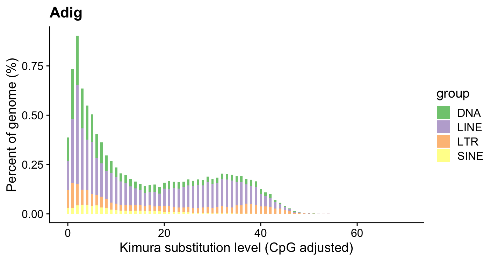

# ttgenome
 genome analysis and visulization tools

## install

``` r
# install.package("remotes")   #In case you have not installed it.
remotes::install_github("TongZhou2017/ttgenome")
```

## load package

```r
library(ttgenome)
```

## Read data

``` r
divsum <- set_divsum(system.file("extdata","Adig.genome.fasta.divsum",package = "ttgenome"),"Adig",415842489)
```

## Visulization

``` r
p3(divsum)
```


``` r
p3(divsum,keep_unknown = FALSE)
```


``` r
p3(divsum,sublabel = TRUE,keep_unknown = FALSE)
```

